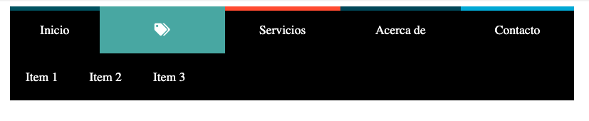

## Introducción

En este tutorial, exploraremos cómo crear un menú de navegación sofisticado utilizando HTML5, CSS3 y Font Awesome para iconos. Nuestro menú tiene características únicas como efectos de hover, iconos descriptivos y un diseño responsive.



## Características Principales

- Menú horizontal con fondo negro
- Iconos para cada elemento de navegación
- Efectos de hover interactivos
- Submenú desplegable
- Cambio de color por sección

## Estructura HTML

```html
    <header>
        <nav>
            <ul>
                <li>
                    <a href="#">
                        <span class="primero">
                            <i class="icon fas fa-home"></i>
                        </span>
                        Inicio
                    </a>
                </li>
                <li>
                    <a href="#">
                        <span class="segundo">
                            <i class="icon fas fa-tags"></i>
                        </span>
                        Categorias
                    </a>
                    <ul>
                        <li><a href="#">Item 1</a></li>
                        <li><a href="#">Item 2</a></li>
                        <li><a href="#">Item 3</a></li>
                    </ul>
                </li>
                <!-- Más elementos de menú -->
            </ul>
        </nav>
    </header>
```

## Estilos CSS Destacados

### Diseño Base

```css
    nav > ul {
        display: table;
        width: 100%;
        background: #000;
        position: relative;
    }

    nav > ul li {
        display: table-cell;
    }
```

### Efectos de Hover

```css
    nav > ul > li > a:hover > span {
        top: 0;
    }

    nav > ul > li > ul > li a:hover {
        background: #5da5a2;
    }
```

### Transiciones Suaves

```css
    nav > ul > li > a {
        transition: all 0.3s ease;
    }
```

## Colores por Sección

Cada sección tiene un color de fondo único:

- Inicio: `#0e5061`
- Categorías: `#5da5a2`
- Servicios: `#f25724`
- Acerca de: `#174459`
- Contacto: `#37a4d9`

## Dependencias

Para este menú, necesitarás:
- Font Awesome (incluido via CDN)
- CSS moderno
- Navegador compatible con Flexbox

## Mejoras Potenciales

1. Hacer el menú responsivo
2. Añadir animaciones más complejas
3. Implementar submenús multinivel
4. Optimizar para dispositivos móviles

## Código Completo

### Código Original

Si deseas ver el código fuente original y una demostración interactiva, puedes consultar el CodePen:

**CodePen:** [Menú Desplegable](https://codepen.io/draexx/pen/wvqGbyp)

### Implementación en tu Proyecto

Para implementar este menú, combina el siguiente HTML y CSS:

#### HTML
```html
    <html>
    <head>
        <title>Menu</title>
        <script src="https://kit.fontawesome.com/50d057ce3b.js" crossorigin="anonymous"></script>
    </head>
    <body>
        <header>
        <nav>
            <ul>
                <li>
                    <a href="#">
                        <span class="primero">
                            <i class="icon fas fa-home"></i>
                        </span>
                        Inicio
                    </a>
                </li>
                <li>
                    <a href="#">
                        <span class="segundo">
                            <i class="icon fas fa-tags"></i>
                        </span>
                        Categorias
                    </a>
                    <ul>
                    <li><a href="#">Item 1</a></li>
                    <li><a href="#">Item 2</a></li>
                    <li><a href="#">Item 3</a></li>
                    </ul>
                </li>
                <li>
                    <a href="#">
                        <span class="tercero">
                            <i class="icon fas fa-suitcase"></i>
                        </span>
                        Servicios
                    </a>
                </li>
                <li>
                    <a href="#">
                        <span class="cuarto">
                            <i class="icon fas fa-file-alt"></i>
                        </span>
                        Acerca de
                    </a>
                </li>
                <li>
                    <a href="#">
                        <span class="quinto">
                            <i class="icon fas fa-envelope"></i>
                        </span>
                        Contacto
                    </a>
                </li>
            </ul>
        </nav>
        </header>
    </body>
    </html>
```

#### CSS
```css
    * {
    margin: 0;
    padding: 0;
    }
    header {
    margin-top: 10px;
    width: 100%;
    height: 150px;
    overflow: hidden;
    position: relative;
    }
    nav {
    top: -20px;
    position: absolute;
    left: 0;
    right: 0;
    margin: 20px auto;
    max-width: 1000px;
    width: 90%;
    }
    nav ul {
    list-style: none;
    }
    nav > ul {
    display: table;
    width: 100%;
    background: #000;
    position: relative;
    }
    nav > ul li {
    display: table-cell;
    }
    nav > ul > li:hover > ul {
        display: block;
        height: 100%;
    }
    nav > ul > li > ul {
        display: block;
        position: absolute;
        background: #000;
        left: 0;
        right: 0;
        overflow: hidden;
        height: 0%;
        transition: all 0.3s ease;
    }
    nav > ul li a {
        color: #fff;
        display: block;
        line-height: 20px;
        padding: 20px;
        position: relative;
        text-align: center;
        text-decoration: none;
        transition: all 0.3s ease;
    }
    nav > ul > li > ul > li a:hover {
        background: #5da5a2;
    }
    nav > ul > li > a span {
        background: #174459;
        display: block;
        height: 100%;
        width: 100%;
        left: 0;
        position: absolute;
        top: -55px;
        transition: all 0.3s ease;
    }
    nav > ul > li > a span .icon {
        display: block;
        line-height: 60px;
    }
    nav > ul > li > a:hover > span {
        top: 0;
    }
    nav > ul > li:hover > a > span {
        top: 0;
    }

    /* Colores */
    nav ul li a .primero { background: #0e5061; }
    nav ul li a .segundo { background: #5da5a2; }
    nav ul li a .tercero { background: #f25724; }
    nav ul li a .cuarto { background: #174459; }
    nav ul li a .quinto { background: #37a4d9; }
```

## Consideraciones Finales

Al implementar este menú, asegúrate de:
- Incluir la librería de Font Awesome
- Copiar tanto el HTML como el CSS
- Verificar la compatibilidad en diferentes navegadores

## Consejos de Implementación

- Usa transiciones CSS para efectos suaves
- Mantén el diseño simple y limpio
- Asegúrate de la accesibilidad
- Prueba en múltiples dispositivos

## Desafío para el Lector

Intenta:
- Personalizar los colores
- Añadir más elementos al menú
- Crear un menú responsivo
- Implementar animaciones más complejas

**¡Feliz codificación!**